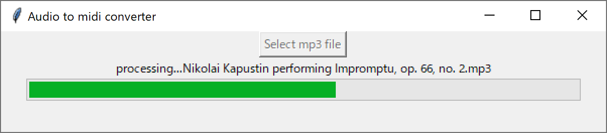

# Piano transcription inference with simple GUI

forked from:
https://github.com/qiuqiangkong/piano_transcription_inference

I added a simple GUI to it.

## Installation
1. `pip install -r requirements.txt`
2. Download `ffmpeg.exe` and locate on root dir
3. Download pretrained model from https://zenodo.org/record/4034264 then locate on `model_file/`
4. Pack to .exe file by `pyinstaller audio2midi.spec`

## Usage

1. Click "audio2midi.exe" (It will take a little moment to boot up)
2. Push "Select mp3 file" then select audio files to convert
3. Conversion will start (conversion will take more than few minutes. It depends on music length)
4. Output folder will automatically open after conversion

If you want to cancel the conversion, just close the window.